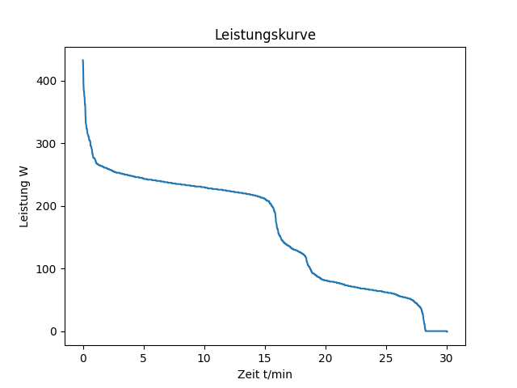

# programmier-bung_2_aufgabe_1_dummy

uv im Browser gedownloaded
uv init im Terminal
github neues Projekt erstellt
das Projekt gedownloaded, uv init

Funktionen und Dateien:
load_data
main.py
sort.py 
